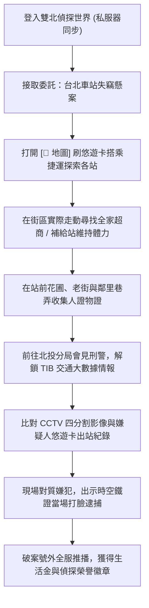

# 📋 專案功能規格與系統設計書 (Project Specification)

> 本文件詳列《雙北漫遊偵探：都會行蹤》✕《城市脈動：通勤偵探》的系統架構、數值設計、捷運站點配置、道具清單與事件狀態機。

---

## 一、 核心遊戲循環 (Core Game Loop)

---

## 二、 角色屬性與數值系統 (Player Attributes)

| 屬性名稱 | 範圍 | 初始值 | 影響機制 | 恢復途徑 |
| :--- | :--- | :--- | :--- | :--- |
| **體力 (Stamina)** | 0 ~ 100 | 78 | 移動奔跑時微量消耗。低於 18 時進入「⚠️ 體力不支」狀態，速度減半。 | 全家茶葉蛋 (+25)、CoCo手搖飲 (+35)、夜市小吃 (+100)、長椅休息 (+50)、保溫瓶溫水 (+25)。 |
| **心情 (Mood)** | 0 ~ 100 | 85 | 影響行動精神狀態。過低會影響調查專注力。 | 運動飲料 (+20)、珍奶 (+30)、淡水河看風景發限動 (+25)、觀賞 101 煙火 (全滿)。 |
| **悠遊卡生活金** | $0 ~ $9999 | $200 | 用於搭乘捷運 ($20/次)、超商購物、購買裝備。 | 破解委託破案 (+100)、拾獲彩蛋 (+50)。 |
| **移動速度** | 基礎 0.20 | 0.20 | 裝備「柯南極速滑板」後速度提升至 0.32 (+60%)。 | 購買滑板 ($300)。 |

---

## 三、 雙北捷運探索站點與街區配置 (Metro Exploration Network)

玩家透過 `[📍 地圖]` 扣款 $20 捷運票價轉乘，各站特色如下：

| 站點名稱 | 捷運路線 | 街區實體配置與探索地標 | 專屬互動與事件 |
| :--- | :--- | :--- | :--- |
| **1. 中山站** | 🔴 淡水信義線 🟠 中和新蘆線 | • CoCo 都可手搖飲旗艦門市 • 全家便利商店 (中山店) • Ubike 停放站、林蔭人行道 | 購買經典珍奶、四季春青茶，詢問店員目擊情報。 |
| **2. 台北車站** | 🔴 淡水信義線 🔵 板南線 | • 四鐵共構站前大廳 • 站前全家超商門市 • 站前花圃神祕紙條 | 調查花圃拾獲暗號紙條「14:38 北車站閘門碰面」。 |
| **3. 雙連站 / 寧夏夜市** | 🔴 淡水信義線 | • 寧夏夜市美食小吃街 • 現炸鹽酥雞攤位 • 炭烤章魚燒攤位 • 圓環全家超商門市 | 品嚐道地夜市美食，體力與心情瞬間回滿。 |
| **4. 淡水渡船頭** | 🔴 淡水信義線 (端點站) | • 淡水河碼頭觀景棧道 • 往返八里渡輪登船處 • 遠眺觀音山稜線步道 | 欣賞河景海風、拍照留念解鎖攝影成就、發 Instagram 限時動態。 |
| **5. 信義商圈 / 象山** | 🔴 淡水信義線 | • 鄰里靜謐老巷弄 • 阿嬤泡茶圓木桌 • 台北 101 高空觀景台 | 與阿嬤聊天收集八卦情報，夜間觀賞台北 101 萬千花火大秀。 |
| **6. 北投公園 / 分局** | 🔴 新北投支線 | • 北投公園涼亭長椅急救處 • 北投分局偵查隊指揮部 • 警車巡邏警戒線現場 | **【情報站專屬】**：與林巡官會面解鎖 TIB 交通大數據與 CCTV 四分割監控。 |

---

## 四、 情報站 (TIB) 交通大數據時空分析規格

**觸發條件**：必須實際抵達「北投分局・偵查隊」並與官方巡官交談。

### 1. 嫌疑人悠遊卡乘車時序比對紀錄
- **卡號**：`042-8871-3329`
- **14:15**：板南線 板橋站 刷卡進站（起步）
- **14:38**：台北車站 B1 閘門 出站扣款 $30（⚠️ 案發時間點抵達現場！戳破不在場謊言！）

### 2. CCTV 四分割影像軌跡追蹤
- **CAM 01 (14:03:21) 捷運站出口**：黑帽男子背黑色後背包走出閘門。
- **CAM 02 (14:05:47) 中正路口**：穿越行人斑馬線向北移動。
- **CAM 03 (14:12:32) 八里渡船頭**：現身碼頭棧道，神情慌張。
- **CAM 04 (14:16:03) 八里老街**：混入老街人潮，手持失竊公事包。

---

## 五、 隨身背包物品規格 (Inventory Items)

1. **雙北悠遊卡 (EasyCard)**：餘額隨扣款與破案即時變動，支援捷運刷卡與超商購物。
2. **熱騰騰茶葉蛋**：體力 +25，恪守減塑不索取多餘塑膠袋。
3. **CoCo 珍珠奶茶**：體力 +35、心情 +30。
4. **柯南極速電動滑板**：裝備後小偵探腳踩滑板，奔跑速度 +60%。
5. **站前暗號紙條**：記有台北車站時空密碼。
6. **便攜放大鏡**：偵探基本調查裝備。
