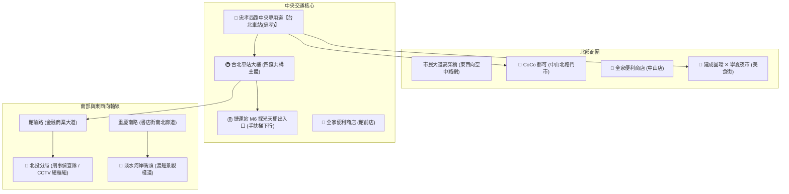

# 📋 專案功能規格與系統設計書 (Project Specification)
### 《雙北漫遊：都會行蹤》- 現代 2D/2.5D 動漫都會冒險 RPG

> 本文件詳列遊戲改版為「現代 2D ✕ 2.5D 動漫都會冒險 RPG」的系統架構、雙速移動機制（走路與跑步）、整倍擴大雙北全路網、公車通勤主軸、店面品牌視覺與事件規格。

---

## 一、 核心視覺與引擎設計方針 (Visual & Engine Architecture)

### 1. 拒絕死板格點，打造「現代流暢動漫 RPG (Modern Urban Anime RPG)」
- **非傳統 RPG Maker 16x16 死板格子走法**：採用高幀率 60FPS 向量自由座標平滑位移，支援 360 度全方向無縫行走與跑步。
- **2D ✕ 2.5D 深度分層渲染 (Depth Layering & Y-Sorting)**：
  - **底層 (Ground Layer)**：真實柏油路面、雙黃線、公車專用道深藍鋪面、行人斑馬線、人行道磚紋。
  - **物體與建築層 (Y-Sort Depth)**：依據 Y 軸動態排序，人物可自由繞行在建築物、路燈、公車站亭、樟樹林蔭、CoCo吧檯前方或後方，呈現立體前後遮蔽感。
  - **頂層高架與遮罩 (Overhead Layer)**：市民大道高架橋懸浮於空中，人物自橋下穿過時產生陰影投射；天候即時光影渲染（晴天金陽、傍晚夕紅、晴夜霓虹）。
- **100% 跨裝置相容**：基於 HTML5 Canvas 萬能引擎，零 WebGL 白屏風險，在任何學校 Chromebook、iPad、手機與筆電皆能流暢執行。

---

## 二、 雙速移動系統 (Dual Movement Speed System)

針對玩家回饋移動節奏偏慢，全面重構移動速度曲線，提供「走路」與「跑步」兩種動態模式：

| 移動模式 | 觸發方式 | 速度係數 | 體力消耗 | 特殊視覺效果與機制 |
| :--- | :--- | :--- | :--- | :--- |
| **🚶 正常走路 (Walk)** | 預設 WASD / 方向鍵 / 搖桿 | **0.65** (全面大幅提速) | 無消耗 (體力緩慢回充) | 自然踏步足音、微幅步態擺動。適合仔細調查街景與店面。 |
| **🏃 極速奔跑 (Run / Sprint)** | **按住 [Shift] 鍵** 或 點擊 UI **`[🏃 奔跑]` 按鈕** | **1.40** (超光速衝刺，穿梭路段) | 每 2 秒微量消耗 0.4 體力 | 腳底出現疾走殘影與塵土氣流特效！體力低於 15 時自動切回慢走。 |
| **🛹 極速滑板 (Skateboard)** | 超商購買裝備後常駐啟用 | **2.20** (全地圖極速飛馳) | 不耗體力 | 腳踩紅色極速電動滑板，享受穿梭台北大道之快感。 |
| **👻 天眼幽靈巡航 (Drone Flight)** | 空中幽靈自由視角 (滑鼠拖曳 / WASD) | **3.50** (Shift極速 **8.50**) | 零消耗 | 游標拖曳平移加速 1.35x，高空俯瞰全城連鎖網絡與街廓。 |

---

## 三、 完整倍增雙北真實路網拓撲 (Doubled Real Taipei City Map)

地圖整體尺寸整整擴大 2 倍以上（覆蓋虛擬尺度 400m ✕ 350m），將雙北關鍵交通與商圈整合於一體，玩家可無縫自由穿梭各區：

### 街區與建築實體細節（-220m ~ +220m 全象限 9x9 大道路網）：
1. **東西向 9 大主要幹道**：民權西/東路 (`z: -195`)、民生西/東路 (`z: -140`)、南京西/東路 (`z: -95`)、長安西/東路 (`z: -48`)、忠孝西/東路一段 (`z: 0`，36m公車專用道)、許昌街 (`z: 44`)、漢口/武昌街 (`z: 72`)、衡陽路 (`z: 98`)、板橋縣民大道一段 (`z: 130`)、板橋學府路一段 (`z: 168`，1:1商圈)、板橋文化路一段/府中路 (`z: 195`)。
2. **南北向 9 大主要幹道**：淡水河環河路/迪化街 (`x: -185`)、西門町漢中街 (`x: -178`)、大同延平北路 (`x: -145`)、西門町中華路一段 (`x: -145`，林蔭綠帶)、大同重慶北路/中正重慶南路 (`x: -85 ~ -92`)、寧夏路/館前路 (`x: -55 ~ -32`)、南陽街/公園路 (`x: 15 ~ 48`)、中山北路一段/二段 (`x: 78`，36m樟樹林蔭大道)、林森北路 (`x: 108`)、松江路 (`x: 155`)、復興北路/南路 (`x: 185`)、板橋府中路/重慶路 (`x: -175 ~ -110`)。
3. **CoCo 都可（手搖飲連鎖網路，15 處分店）**：
   - 涵蓋分店：站前南陽店、站前許昌店、站前開封店、重慶書店街店、中山北路門市、中山南京店、中山雙連店、建成圓環店、寧夏民生店、延平北路店、西門武昌店、板橋府中店、板橋學府店、板橋文化店、松江南京店。
   - 視覺：亮橘色波浪招牌、經典微笑商標、木質點餐吧檯、雙大不銹鋼保溫茶桶。
   - 商品：招牌珍珠奶茶 ($50, +35 體力 / +30 心情)、四季春青茶 ($35, +20 體力)。
4. **全家便利商店 FamilyMart（30 處真實連鎖門市）**：
   - 涵蓋分店：板橋學府店 (學府路一段 146 號)、板橋學府二店 (學府路一段 98 號)、板橋學府三店 (學府路一段 188 號)、板橋府中店、板橋重慶店、板橋縣民店、板橋文化店、站前館前店、站前忠孝店、站前許昌店、站前開封店、站前南陽店、重慶南路店、懷寧襄陽店、中山北路店、中山南京店、中山長安店、中山雙連店、中山民權店、林森錦州店、建成圓環店、寧夏夜市店、延平北路店、迪化民樂店、大同大橋店、西門町漢中店、西門武昌店、西門中華店、松江南京店、復興南京店。
   - 視覺：經典綠藍雙色燈箱招牌、自動玻璃滑門、茶葉蛋蒸煮區。
   - 商品：熱騰騰茶葉蛋 ($13, +25 體力)、運動機能飲料 ($25, +20 心情)、極速電動滑板 ($300, 移速 2.20)。
5. **7-Eleven 統一超商（30 處真實 24H 超商連鎖門市）**：
   - 涵蓋分店：板橋學府門市 (學府路一段 62 號)、板橋學府二門市 (學府路一段 158 號)、板橋府中重慶店、板橋府中縣民店、板橋文化店、板橋文化二店、站前忠孝店、站前館前店、站前南陽店、站前許昌店、站前公園店、站前開封店、重慶南路店、中正武昌店、中正衡陽店、中山南京店、中山長安店、中山民生店、中山民權店、林森條通店、寧夏夜市店、重慶北路店、延平北路店、大稻埕迪化店、大同昌吉店、西門漢中店、西門中華店、西門成都店、松江長安店、復興長安店。
   - 視覺：經典亮橘/翠綠/鮮紅三色橫條燈箱招牌、溫暖內透光自動門。
   - 商品：經典肉鬆御飯糰 ($30, +30 體力)、CITY CAFE 冰拿鐵 ($45, +25 心情)、茶裏王日式無糖綠 ($25, +20 體力)。
6. **家樂福 Carrefour（13 處旗艦大賣場與超市便利購）**：
   - 涵蓋分店：家樂福 重慶旗艦店 (雙層大賣場)、家樂福 桂林旗艦店 (24H量販店)、家樂福便利購 板橋學府店 (學府路一段 192 號)、家樂福超市 重慶南店、中山店、板橋府中店、南京西店、站前開封店、板橋文化店、延平北店、雙連店、西門漢中店、松江店。
   - 視覺：經典紅白藍 C 字招牌、挑高雙層大型玻璃立面。
   - 商品：家庭號能量吐司 ($40, +45 體力)、大瓶運動補給水 ($30, +35 心情)、調查員手提補給箱 ($120)。
7. **全聯福利中心 PX Mart（14 處社區生鮮超市）**：
   - 涵蓋分店：全聯 板橋學府店 (學府路一段 180 號)、板橋府中店、板橋文化店、板橋縣民店、延平店、重慶店、中正武昌店、站前開封店、中山南京店、中山吉林店、中山雙連店、西門長沙店、大稻埕民生店、站前漢口店。
   - 視覺：藍底紅白蝴蝶雙圓標誌、生鮮落地櫥窗。
   - 商品：高纖蘋果 ($35, +35 體力)、高纖豆漿 ($25, +25 體力/+20 心情)、生鮮活力籃 ($80, +50 體力/+40 心情)。
8. **傳統市場與觀光夜市（10 處在地特色傳統市集與夜市）**：
   - 涵蓋點位：中山傳統市場、雙連傳統市場、城中市場老市集、大稻埕永樂市場、建成圓環 ✕ 寧夏夜市、西門市場 ✕ 紅樓文創市集、板橋黃石傳統市場、板橋湳雅觀光夜市、晴光傳統商圈市場、大同蘭州傳統市場。
   - 視覺：紅金雙色遮雨棚、懸掛紅燈籠、熱氣小吃攤檔、老字號木匾招牌。
   - 商品與功能：古早味切仔麵 ($45)、現包傳香潤餅捲 ($50)、現炸旗魚黑輪 ($30)，市井人情味線索打聽樞紐。
9. **台北車站大樓**：宮殿廡殿頂傳統屋頂意象、站前電子時鐘。
10. **捷運出入口（M6 亭、中山站、府中站）**：採光頂棚、下行手扶梯階梯，進入地下月台搭乘淡水信義線與板南線。

### 連鎖品牌 50% 剪裁法則 (Pruning Rule) ✕ 嚴禁商店並排 ✕ 8 大象限空間分散架構：
- **嚴禁商店並排（Strictly No Side-by-Side Row Layout）**：任何街道與騎樓絕不出現商店連排緊鄰之現象。每一街廓與十字路口僅座落單一代表性門市，全圖任兩設施物理間距嚴格保證 $\ge 38.0\text{m}$（平均街距達 60m ~ 120m+）。
- **自然廣泛分散於雙北 8 大核心行政象限**：70 處代表性門市與設施均勻座落於：台北車站站前核心、重慶南路書街、西門町、大同大稻埕寧夏、中山北路林蔭雙連晴光、東區松江復興、南區古亭師大大安、板橋學府路一段 (特別指定！) ✕ 新板特區府中文化路。
- **最多刪除一半**：任何路段或全區之同品牌門市，最多僅能刪減 50%（如學府路一段若有 5 間全家，最多刪 2 間，至少保留 3 間）。
- **留存店家 100% 精準對齊現實**：留存門市與市場之名稱、門牌路名與幾何座標必須與真實雙北完全相符，絕不隨意捏造！
- **街廓大廈群與行道林蔭全面進駐（Urban Fabric Infill）**：各超商/手搖飲/超市之間穿插【新光摩天大樓】、【新板大遠百】、【二二八公園】、【大安森林公園】、【金融科技大樓】、【百年巴洛克街屋】與【整排樟樹/欒樹林蔭】，還原真實雙北開闊都會風貌！

---

## 四、 公車主軸通勤與空拍鳥瞰過場 (Bus-Centric Transit & Cutscene)

- **拒絕瞬間移動**：地圖純供查閱路線與站牌位置，嚴禁點擊瞬移。
- **307 幹線公車 ✕ 捷運列車**：
  - 路線行駛於忠孝西路專用道與中山北路。
  - 走到站牌靠近 307 公車，嗶悠遊卡上車（扣款 $15）。
  - 出現交通 HUD，提供「快轉過場」與「隨車慢遊自由下車」雙模式：
    - **⏩ 快轉過場**：點擊 `[⏩ 快轉過場動畫 (空拍鳥瞰)]`，鏡頭平滑拉高至衛星空拍俯瞰視角，公車在真實雙北路網中高速奔馳至目的地站牌，鏡頭平滑降回地面完成下車！
    - **🚶 隨車漫遊與自由下車**：若不點快轉，玩家角色持續留在公車上，隨車巡航欣賞雙北沿途街景；任何時候皆可點擊 `[🚶 到站下車]` 隨時在路側人行道下車，恢復步行探索。

---

## 五、 情報站 (TIB) 交通大數據與破案機制

- **北投分局會見林巡官**：解鎖 4 分割 CCTV 監視器時序軌跡（忠孝西路 14:03 ➔ 中山北路 14:05 ➔ 307公車候車站 14:12）。
- **現場筆錄對質逮捕**：出示「307 公車 14:12 刷卡紀錄」戳破嫌犯不在場證明，當場逮捕破案！

---

## 六、 實境解謎遊戲盒 ✕ 虛擬線上雙軌聯動架構 (ARG Physical Mystery Box & QR Integration)

### 1. 雙軌並行核心哲學
- **現實實境線 (Lite Track，3~4 關核心地標)**：考慮學生與玩家之體力負荷與街道安全，現實關卡精簡輕量，專注於實體觸感、地標觀察、透光片疊合與開鎖。
- **虛擬線上線 (Full Digital Track，數十分支任務)**：掃描盒內隨附的 QR Code 秒開線上 2D/2.5D RPG，暢玩整倍大雙北全地圖、公車巡航漫遊、連鎖超商採買與 CCTV 時空大數據破案。
- **雙向互鎖機制**：實體盒線索解出線上案情密鑰；線上破案大數據反向產出實體三位數旋轉密碼，開啟實體木盒蓋上榮譽結案印章。

### 2. 實境解謎遊戲盒配件清單 (盒內內容物規格)
1. **💳 都會調查員專屬悠遊卡 (含線上遊戲入口 QR Code)**：高質感燙金磨砂卡，背面 QR Code 直開線上免安裝遊戲。
2. **🗺️ 雙北街區精美手繪折疊大地圖 (A3 仿古磅紙)**：標註台北車站、忠孝西路公車專用道、中山商圈與經緯度刻度。
3. **🔍 時空軌跡透光解密片 (透明硫酸紙套板)**：印製監視器視角與行車軌跡，疊合大地圖透光還原嫌犯路線。
4. **📁 四大實體封緘證物袋**：
   - 證物 A：307 幹線公車實體打洞車票（打洞編號隱含密碼）。
   - 證物 B：站前花圃神祕泥漬便條紙（與線上花圃線索 100% 呼應）。
   - 證物 C：超商購物感熱紙收據（含 7-Eleven、全家明細與減塑標語）。
   - 證物 D：撕碎的時間軸草稿（拼圖復原 14:03~14:12 行蹤）。
5. **🔴 紅色光學濾鏡卡 (紅膠透鏡片)**：過濾嫌犯筆錄上的紅藍雜訊圖紋，顯現真正口供。
6. **⚙️ 便攜雙層密碼旋轉輪盤**：同心圓對齊起迄站點解密替換文字。
7. **🌱 調查員金屬徽章 ✕ 環保減塑帆布手提包**：將六年級「環保減塑、自備提袋」理念實體化之文創紀念品。
8. **🔒 三位數實體旋轉密碼木盒 (終極機關物證箱)**：內藏【雙北榮譽破案金印章】與結案證明書，由線上公車刷卡時間解開！

### 3. 現實實境線 4 大核心地標關卡
- **關卡 1【站前啟程・M6 捷運採光天棚】**：比對實體地標與手繪地圖，掃描卡片 QR Code 進入遊戲。
- **關卡 2【公車站島・307 時空交會】**：在忠孝專用道站牌使用透光硫酸紙解出逃亡方向。
- **關卡 3【商圈巡禮・連鎖門市的隱藏條碼】**：走訪館前路超商周邊，使用紅色濾鏡卡解讀收據。
- **關卡 4【花圃終局・開鎖結案蓋印】**：在站前花圃核對泥漬便條與線上刷卡時間，打開實體密碼木盒蓋印破案！
