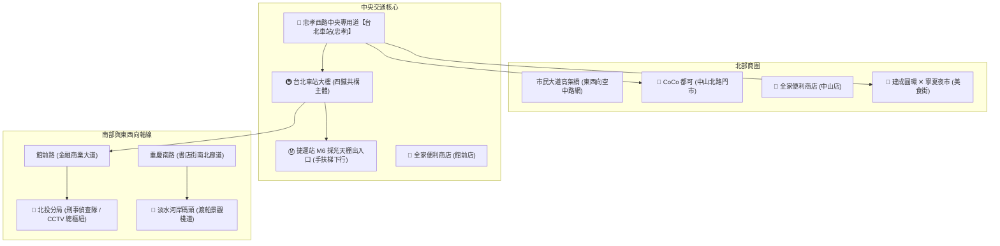

# 📋 專案功能規格與系統設計書 (Project Specification)
### 《雙北漫遊：都會行蹤》- 現代 2D/2.5D 動漫都會冒險 RPG

> 本文件詳列遊戲改版為「現代 2D ✕ 2.5D 動漫都會冒險 RPG」的系統架構、雙速移動機制（走路與跑步）、整倍擴大雙北全路網、公車通勤主軸、店面品牌視覺與事件規格。

---

## 一、 核心視覺與引擎設計方針 (Visual & Engine Architecture)

### 1. 拒絕死板格點，打造「現代流暢動漫 RPG (Modern Urban Anime RPG)」
- **非傳統 RPG Maker 16x16 死板格子走法**：採用高幀率 60FPS 向量自由座標平滑位移，支援 360 度全方向無縫行走與跑步。
- **2D ✕ 2.5D 深度分層渲染 (Depth Layering & Y-Sorting)**：
  - **底層 (Ground Layer)**：真實柏油路面、雙黃線、公車專用道深藍鋪面、行人斑馬線、人行道磚紋。
  - **物體與建築層 (Y-Sort Depth)**：依據 Y 軸動態排序，人物可自由繞行在建築物、路燈、公車站亭、樟樹林蔭、CoCo吧檯前方或後方，呈現立體前後遮蔽感。
  - **頂層高架與遮罩 (Overhead Layer)**：市民大道高架橋懸浮於空中，人物自橋下穿過時產生陰影投射；天候即時光影渲染（晴天金陽、傍晚夕紅、晴夜霓虹）。
- **100% 跨裝置相容**：基於 HTML5 Canvas 萬能引擎，零 WebGL 白屏風險，在任何學校 Chromebook、iPad、手機與筆電皆能流暢執行。

---

## 二、 雙速移動系統 (Dual Movement Speed System)

針對玩家回饋移動節奏偏慢，全面重構移動速度曲線，提供「走路」與「跑步」兩種動態模式：

| 移動模式 | 觸發方式 | 速度係數 | 體力消耗 | 特殊視覺效果與機制 |
| :--- | :--- | :--- | :--- | :--- |
| **🚶 正常走路 (Walk)** | 預設 WASD / 方向鍵 / 搖桿 | **0.38** (比舊版提升近一倍) | 無消耗 (體力緩慢回充) | 自然踏步足音、微幅步態擺動。適合仔細調查街景與店面。 |
| **🏃 極速奔跑 (Run / Sprint)** | **按住 [Shift] 鍵** 或 點擊 UI **`[🏃 奔跑]` 按鈕** | **0.75** (極速衝刺，穿梭路段) | 每 2 秒微量消耗 0.4 體力 | 腳底出現疾走殘影與塵土氣流特效！體力低於 15 時自動切回慢走。 |
| **🛹 極速滑板 (Skateboard)** | 超商購買裝備後常駐啟用 | **1.10** (全地圖飛馳) | 不耗體力 | 腳踩紅色極速電動滑板，享受穿梭台北大道之快感。 |

---

## 三、 完整倍增雙北真實路網拓撲 (Doubled Real Taipei City Map)

地圖整體尺寸整整擴大 2 倍以上（覆蓋虛擬尺度 400m ✕ 350m），將雙北關鍵交通與商圈整合於一體，玩家可無縫自由穿梭各區：

### 街區與建築實體細節：
1. **忠孝西路一段**：東西向寬達 36 公尺的大道，中央配置「公車專用道」與專用候車島，地面繪製雙黃線與公車專用標線。
2. **中山北路一段**：南北向寬 30 公尺的林蔭大道，兩側人行道種植樟樹與楓香樹木造景。
3. **CoCo 都可（手搖飲連鎖網路，3 處分店）**：
   - 分店：中山北路門市、站前南陽店、重慶書店街店。
   - 視覺：亮橘色波浪招牌、經典微笑商標、木質點餐吧檯、雙大不銹鋼保溫茶桶。
   - 商品：招牌珍珠奶茶 ($50, +35 體力 / +30 心情)、四季春青茶 ($35, +20 體力)。
4. **全家便利商店 FamilyMart（超商連鎖網路，3 處分店）**：
   - 分店：中山北路店、站前館前店、建成圓環店。
   - 視覺：經典綠藍雙色燈箱招牌、自動玻璃滑門、茶葉蛋蒸煮區。
   - 商品：熱騰騰茶葉蛋 ($13, +25 體力)、運動機能飲料 ($25, +20 心情)、柯南極速電動滑板 ($300, 移速 +60%)。
5. **7-Eleven 統一超商（24H 超商連鎖網路，3 處分店）**：
   - 分店：站前忠孝店、重慶南路店、中山南京店。
   - 視覺：經典亮橘/翠綠/鮮紅三色橫條燈箱招牌、溫暖內透光自動門。
   - 商品：經典肉鬆御飯糰 ($30, +30 體力)、CITY CAFE 冰拿鐵 ($45, +25 心情)、茶裏王日式無糖綠 ($25, +20 體力)。
6. **台北車站大樓**：宮殿廡殿頂傳統屋頂意象、站前電子時鐘。
7. **捷運出入口（M6 亭）**：採光頂棚、下行手扶梯階梯，進入地下月台搭乘淡水信義線。

---

## 四、 公車主軸通勤與空拍鳥瞰過場 (Bus-Centric Transit & Cutscene)

- **拒絕瞬間移動**：地圖純供查閱路線與站牌位置，嚴禁點擊瞬移。
- **307 幹線公車 ✕ 捷運列車**：
  - 路線行駛於忠孝西路專用道與中山北路。
  - 走到站牌靠近 307 公車，嗶悠遊卡上車（扣款 $15）。
  - 出現交通 HUD，提供「快轉過場」與「隨車慢遊自由下車」雙模式：
    - **⏩ 快轉過場**：點擊 `[⏩ 快轉過場動畫 (空拍鳥瞰)]`，鏡頭平滑拉高至衛星空拍俯瞰視角，公車在真實雙北路網中高速奔馳至目的地站牌，鏡頭平滑降回地面完成下車！
    - **🚶 隨車漫遊與自由下車**：若不點快轉，玩家角色持續留在公車上，隨車巡航欣賞雙北沿途街景；任何時候皆可點擊 `[🚶 到站下車]` 隨時在路側人行道下車，恢復步行探索。

---

## 五、 情報站 (TIB) 交通大數據與破案機制

- **北投分局會見林巡官**：解鎖 4 分割 CCTV 監視器時序軌跡（忠孝西路 14:03 ➔ 中山北路 14:05 ➔ 307公車候車站 14:12）。
- **現場筆錄對質逮捕**：出示「307 公車 14:12 刷卡紀錄」戳破嫌犯不在場證明，當場逮捕破案！
