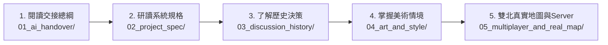

# 📚 AI 協作文檔總覽導航庫 (AI Documentation Hub)

> **歡迎其他接續本專案之 AI Agent / 開發者！**  
> 本資料夾為本專案的核心文檔中樞，已依照系統功能、歷史紀錄、美術指南與交接守則完成階層化分類。  
> 請依照下方推薦的**「閱讀順序」**進行檢視，以利最快掌握全貌並無縫開展後續開發。

---

## 🧭 推薦閱讀順序 (Recommended Reading Order)

---

## 🗂️ 文檔分類目錄與詳細說明

| 分類資料夾 | 文件名稱 | 說明與重點內容 | 連結 |
| :--- | :--- | :--- | :--- |
| **`01_ai_handover/`** | 🤖 `AI_HANDOVER.md` | **【最重要！必讀】** • 使用者痛點與核心誡命（禁止死機白屏、禁止直達商店按鈕、禁止生硬貼圖）。 • 雙核心渲染架構（3D WebGL ✕ 2.5D Canvas）。 • 給後續 AI 的審查與開發工作流。 | [前往文件](./01_ai_handover/AI_HANDOVER.md) |
| **`02_project_spec/`** | 📋 `PROJECT_SPEC.md` | **【系統功能規格書】** • 核心遊戲循環與狀態機。 • 角色數值（體力、心情、生活金、移動速度）。 • 雙北捷運 6 大探索站點與街區配置。 • TIB 交通大數據時空比對規格。 | [前往文件](./02_project_spec/PROJECT_SPEC.md) |
| **`03_discussion_history/`** | 📜 `DISCUSSION_LOG.md` | **【歷次使用者討論紀錄】** • 第 1 回合：初始企劃與靜態網頁 RPG 建立。 • 第 2 回合：升級 3D 玩法與專屬私服器。 • 第 3 回合：黑屏修復與必須親自走到門口。 • 第 4 回合：雲端截圖 HUD 與動漫立繪對齊。 • 第 5 回合：WebGL 報錯根治、捷運探索地圖、去圖片化。 | [前往文件](./03_discussion_history/DISCUSSION_LOG.md) |
| **`04_art_and_style/`** | 🎨 `ART_STYLE_GUIDE.md` | **【美術風格與概念圖手冊】** • Google Drive `遊戲圖片~待處理` 41 張概念圖分類剖析。 • 視覺基調（Cyber Cyan ✕ 台灣街頭暖金黃）。 • 明確規範：參考圖是美術情境指導，絕不可當作死板彈窗貼圖！ | [前往文件](./04_art_and_style/ART_STYLE_GUIDE.md) |
| **`05_multiplayer_and_real_map/`** | 🌐 `SERVER_AND_GIS_GUIDE.md` | **【萬人同服 ✕ 雙北真實道路 (GIS)】** • 「所有人都在同一個世界」的 Server 原理與免費雲端部署（Render/Railway）。 • OpenStreetMap (OSM) 雙北真實道路向量轉 3D 坐標演算法。 | [前往文件](./05_multiplayer_and_real_map/SERVER_AND_GIS_GUIDE.md) |

---

## ⚡ 快速指令指引

- **本機啟動私服器**：`npm start`（監聽 `http://localhost:3000` 與 `ws://localhost:3000`）
- **代碼語法檢驗**：`node -c game.js && node -c server.js`
- **線上 GitHub Pages 試玩**：[https://hsiaoyujui114-code.github.io/taipei-metro-detective-rpg/](https://hsiaoyujui114-code.github.io/taipei-metro-detective-rpg/)
